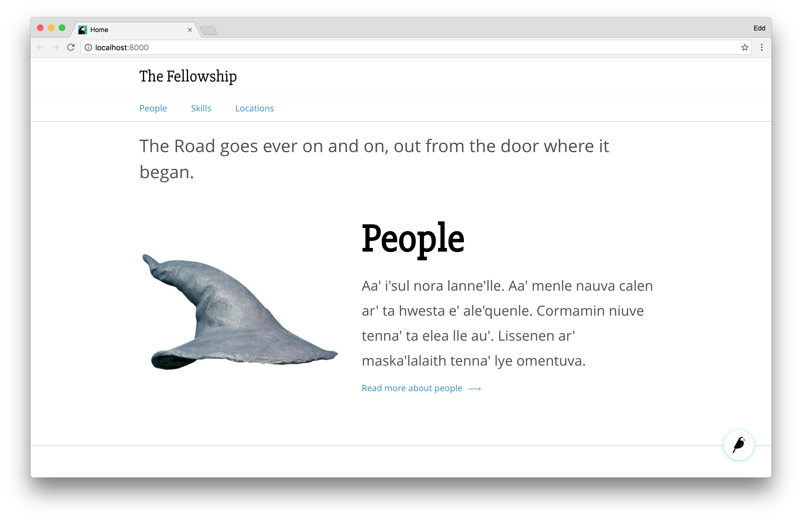
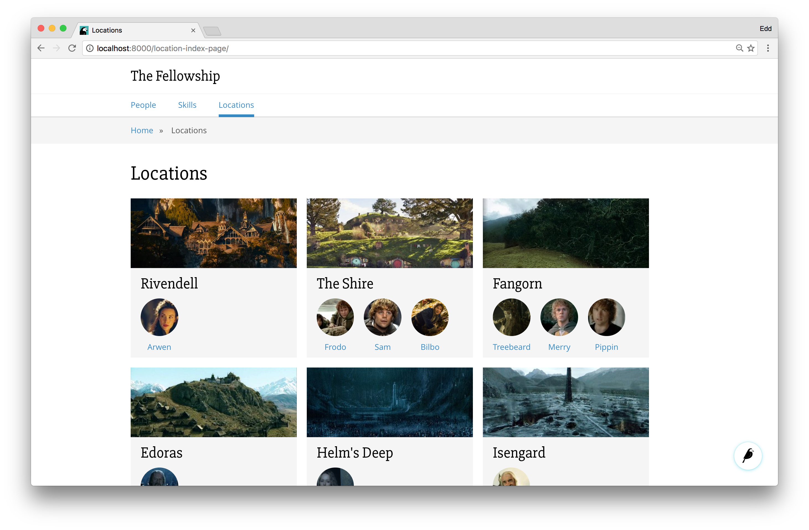
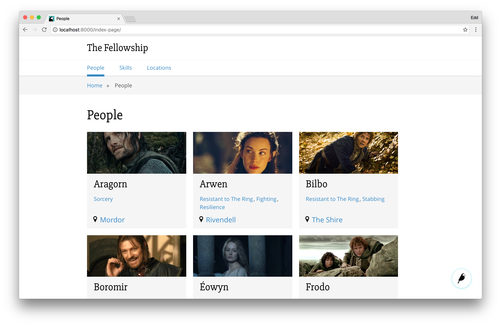
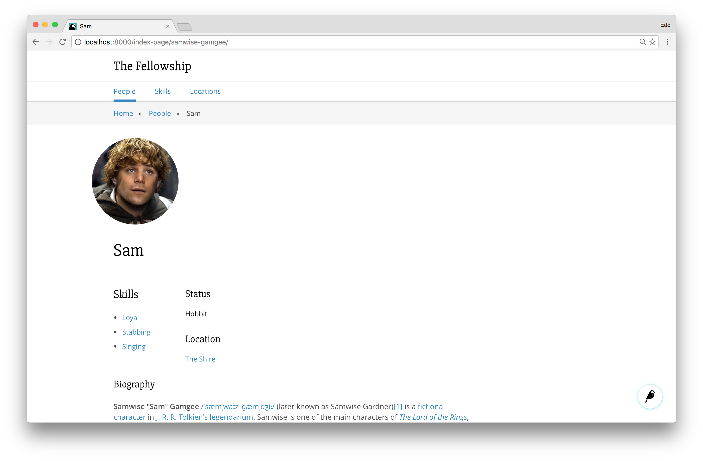
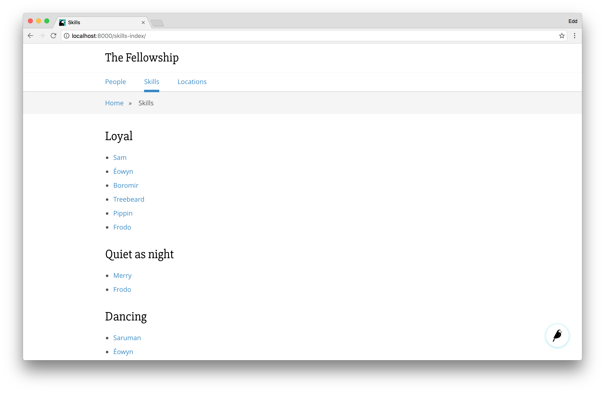
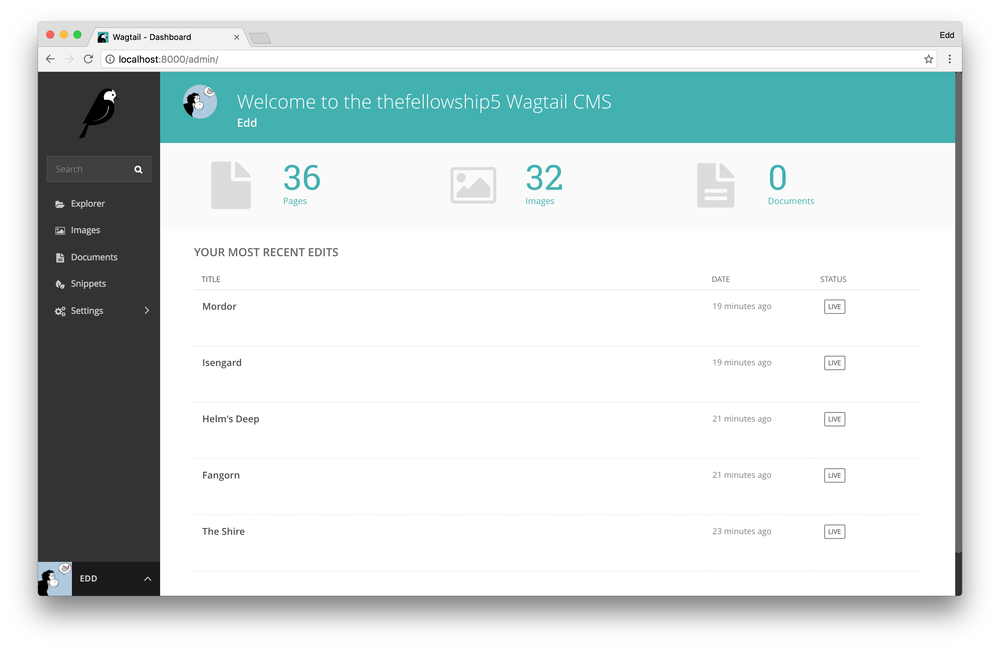

Beginner Wagtail Cookiecutter
=============================

This is a [cookiecutter](https://github.com/audreyr/cookiecutter) template for an example Wagtail site.

It's a commented, simple implementation of Wagtail styled around a basic company website. It is designed to demonstrate

 - Relationships between pages (ManyToMany and OneToMany relationships)
 - A global StreamField
 - Use of Snippets
 - Lots of Lords of the Rings geekery

## What's included
This Cookiecutter project includes

 - Wagtail
 - Vagrant configuration that uses the [torchbox/wagtail](https://github.com/torchbox/vagrant-wagtail-base) base box
 - Heroku configuration (including an example .env file)
 - Example apps: `home`, `people`, `skills` and `locations`

## Installation
The Cookiecutter project can be built with the following commands
```sh
# Install Cookiecutter
- pip install cookiecutter
- cookiecutter https://github.com/heymonkeyriot/beginner-wagtail.git
# You'll be prompted to give the project a name
# You'll be prompted to give the repository a name
- cd {{your_project_name}}
- vagrant up
```

Note: The first time you run `vagrant up` it will likely take around 15 minutes to install the Wagtail Vagrant base box.

**Please refer to `{{your_project_name}}`/readme.md for information on installing and running Wagtail once the Cookiecutter has been installed.**

# Example screens

Homepage with loaded data


Location index page with loaded data


People index page with loaded data


Person page with loaded data


Skills index page with loaded data


Absolutely out-of-the-box admin area screen

# Troubleshooting
## Name of Cookiecutter project
You can't name your project `abc`. It conflicts with name spacing in /lib/python3.4/io.py